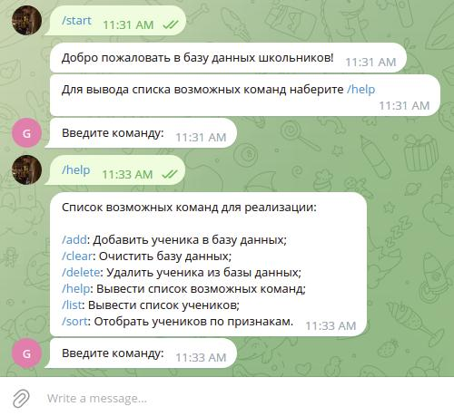
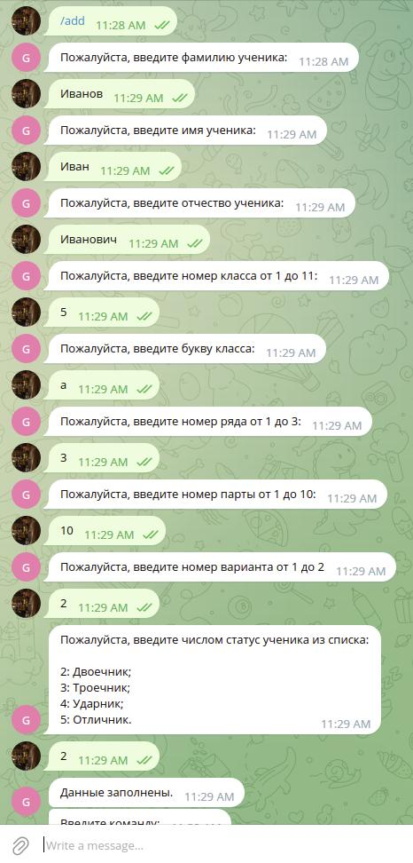
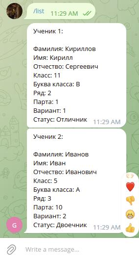
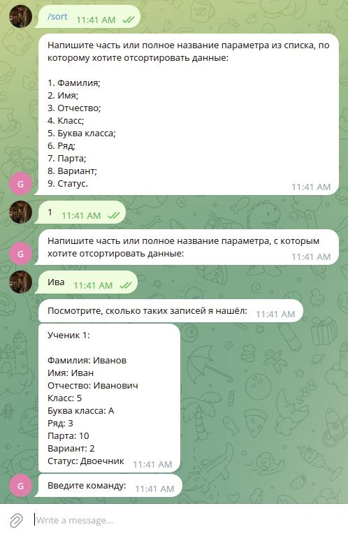
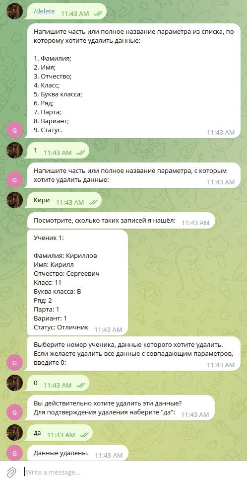

# **Программа для ведения базы данных (БД) школьников с внешним хранилищем**
## **Архитектура программы:**

## **Описание работы программы:**
Программа работает через бота в мессенджере Telegram с соответствующим токеном, который нужно вставить в поле API_TOKEN. 

1. Запуск бота осуществляется через команду **/start**, после чего пользователю необходимо ввести определенную команду. В случае, если пользователь не знает доступные команды, он может ввести **/help**, gосле чего получит список команд, соответствующих их описанию:



```
P.S.: Если ввести несуществующую команду, программа выдаст предупреждение.
```

2. При вводе команды добавления ученика (**/add**), пользователю необходимо последовательно вводить данные по инструкциям:



```
P.S.: При вводе неверного значения из числовых диапазонов в течение заполнения данных программа сбросит ввод.
```

3. При вводе команды вывода списка учеников (**/list**) в боте выводятся все ученики, находящиеся в БД:



4. При вводе команд очистки БД (**/clear**) очистится вся БД.

```
P.S.: Если в БД ничего нет, то выводится сообщение, что БД пуста.
```

5. При вводе команды выборки данных (**/sort**), пользователю необходимо сначала ввести номер параметра из списка, по которому он хочет выделить учеников. После этого нужно ввести часть или полное название параметра, с которым он хочет отсортировать данные, после чего программа выдаст список подходящих под критерий учеников:



6. Команда удаления данных (**/delete**) аналогична предыдущей. Дополнительно пользователю нужно будет выбрать из выпадающего списка номер ученика, которого он хочет удалить, либо удалить всех учеников сразу с подходящим параметром с соответствующим подтверждением:



```
P.S.: В командах /sort и /delete если подходящего ничего нет, то выводится соответствующее сообщение.
```

**Над приложением работал Кириллов Кирилл.**